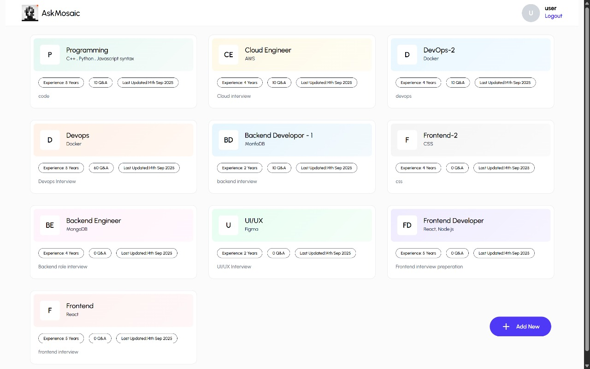
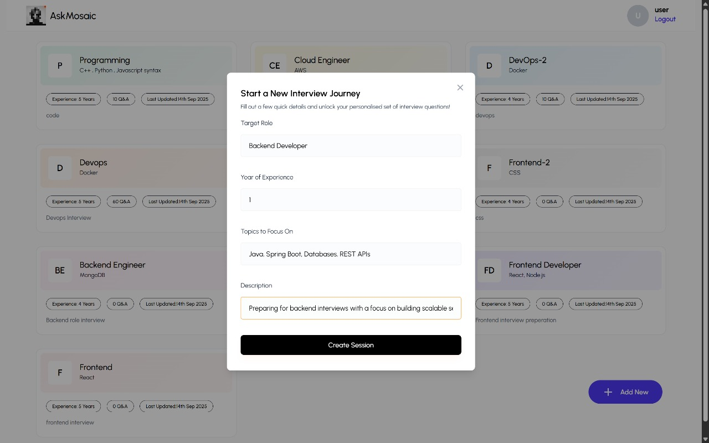
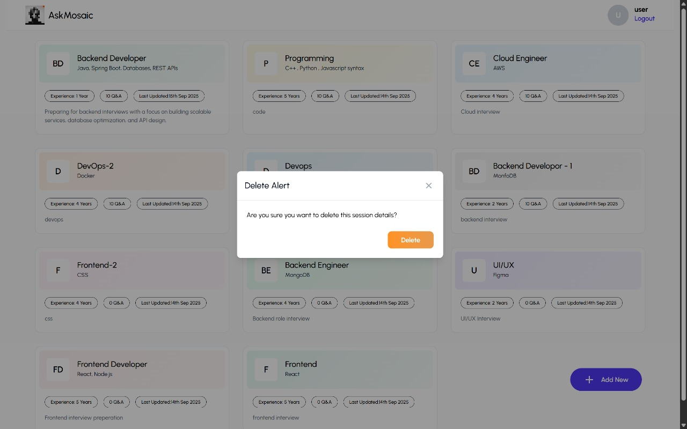
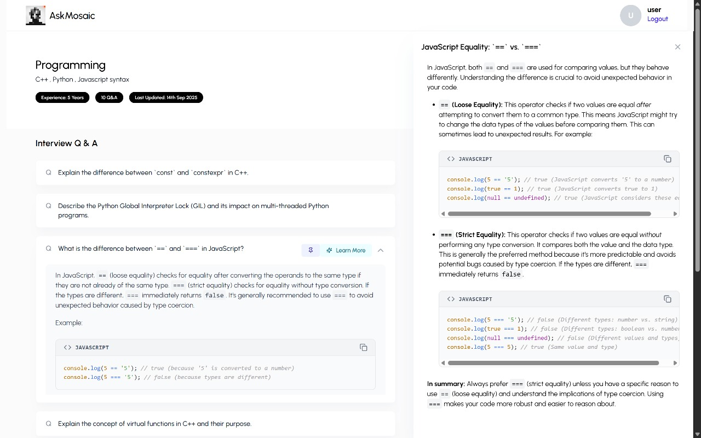
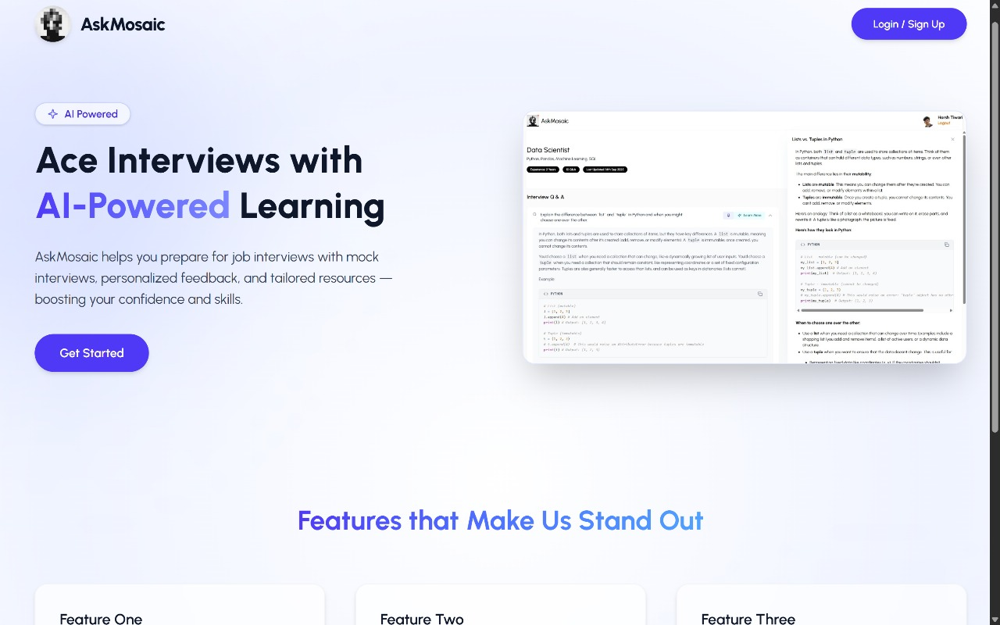

# AskMosaic – AI Interview Prep App

An **AI-powered Interview Preparation App** built with the **MERN stack** (MongoDB, Express, React, Node.js).  
AskMosaic helps users practice interviews by generating role-based technical questions, answers, and explanations with AI, while providing a smooth and responsive UI.

---

## ✨ Features

1. **User Authentication** – Register and log in securely with JWT-based authentication.
2. **Role-Based Interview Sessions** – Generate questions tailored to job role & experience.
3. **AI-Powered Q&A** – Get high-quality technical questions and answers using **Google Gemini API**.
4. **Accordion Learning UI** – Expandable/collapsible Q&A for a clean study flow.
5. **Dynamic AI Explanations** – On-demand breakdowns and detailed answers.
6. **Pinning Important Questions** – Mark and save key questions for quick access.
7. **MongoDB Storage** – Store and manage interview sessions & questions.
8. **Responsive Frontend** – Built with **React + Tailwind CSS** for modern, clean UI.

---

## 🖼️ Screenshots

| All Sessions | Create Interview | Delete Session | Interview UI | Landing Page |
|--------------|------------------|----------------|--------------|--------------|
|  |  |  |  |  |

---

## 🛠️ Tech Stack

**Frontend**
- React + Vite
- Tailwind CSS
- Axios
- React Router DOM
- Framer Motion

**Backend**
- Node.js + Express
- MongoDB + Mongoose
- JWT Authentication
- Gemini API (for AI Q&A)

**Deployment**
- Frontend → Vercel  
- Backend → (Any Node server: Render, Railway, AWS, etc.)

---

## ⚙️ Installation & Setup

### 1. Clone the repository
```bash
git clone https://github.com/tiwariharsh007/AskMosaic.git
cd AskMosaic
